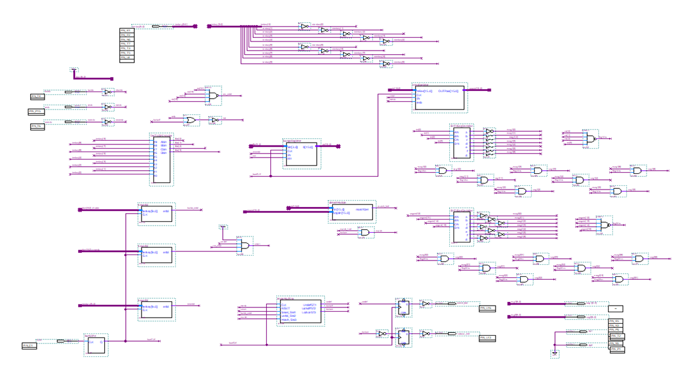
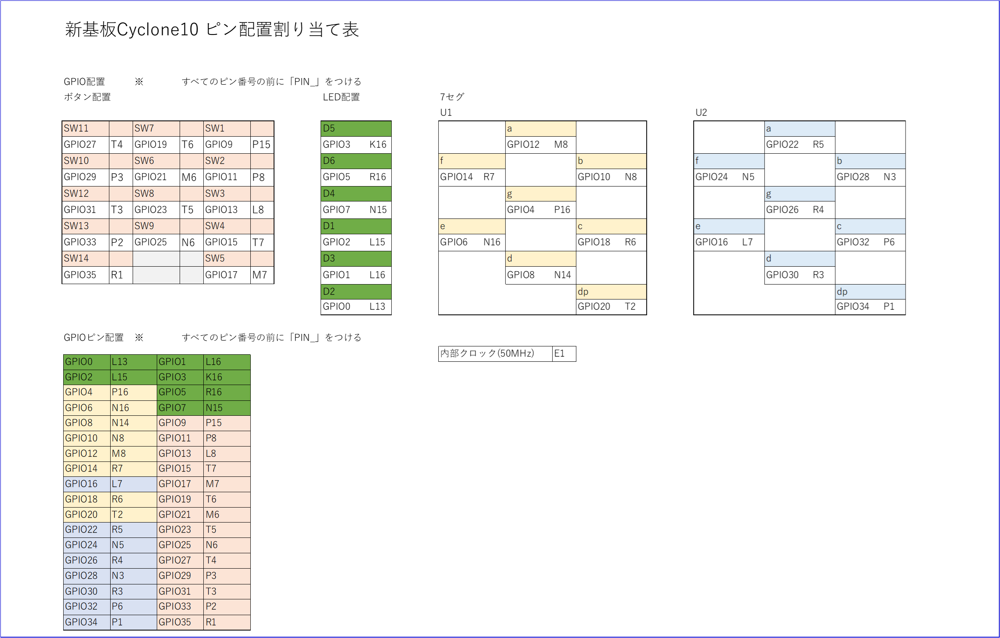
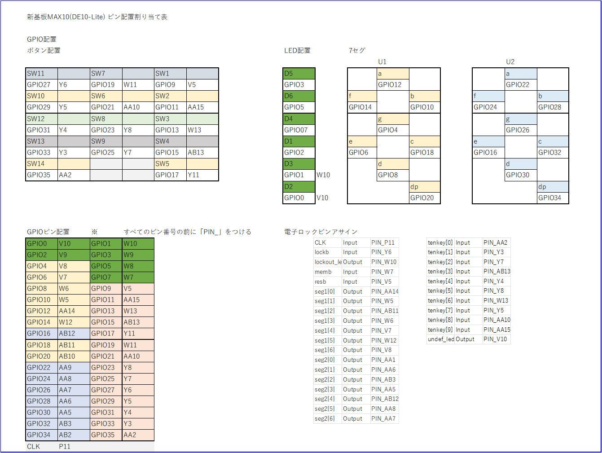

# Cyclone10実験予備実験メモ

## 概要
* ４Eで扱う実験課題を大まかに分けて検証しています。

## 現実験との相違点
* FPGAボードをCyclone ⅡからCyclone 10LPへ変更
* Quartusのバージョンの違いにより波形シミュレーションソフトが組み込まれていないので
QuartusPrimeから直接連携できる、ModelSim(Questa)というシミュレーションソフトを使用する。
    * 波形ソフトはテストベンチが必要（Verilog HDLで検証）
    * テストベンチはQuartus機能で作成可能。テキストエディタもQuartusPrimeで起動可能。
    * ModelSimで課題範囲内でのシミュレーションの設定（クロック等）可能。
* ボードの変更により書き込みソフトをQuartusPrimeに組み込まれているソフト(Programmer)を使用する。  

* Quetaをセットアップする際は、インテル社のHPでアカウント作成とライセンスファイル取得等作業が必要。

# 最終成果物（電子ロック）

## 回路図例

# 実験用ボードのピン配置

## ピン配置・GPIO対応表

### Cyclone10

### MAX10(DE10-Lite)

