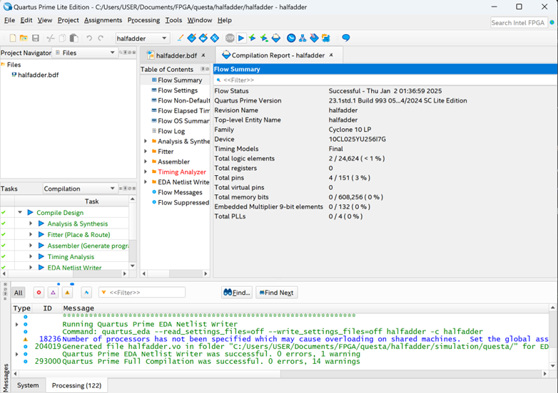

# ModelSim, Questaによるシミュレーション方法

## 概要
* Quartus Primeでは波形シミュレーション方法として内部組み込みのソフトウェアを使用することができない。
* QuartusⅡの組み込みの波形シミュレーションソフトに近い形でシミュレーションを
行えるように使用方法を記載する。ここでは、半加算回路を例にシミュレーションを行う。

## ModelSimでのシミュレーションの流れ
* 通常通りcadソフト等で論理回路を作成して、コンパイルまで済ませておく。
* ProcessingのStartでStart Test Bench Template Writerを実行する。
※テンプレートは自作しても問題ない。プロジェクトフォルダ内のsimulation-questaフォルダ内に.vt拡張子で保存する。

* SettingsのNativeLink SettingsでCompile test benchで先ほどテンプレートライターで作成したテストベンチファイルを指定する。
* 再度、コンパイルを行う。
* Tools の Run simulation ToolsでGate Level Simulationを実行してModelSimを起動する。

* SimulationのStart Simulationを実行する
* Designタブでgate_workでテストベンチを選択、Librariesでcyclone10lp_verを選択し、OKボタンを押すとシミュレーション画面が立ち上がる。
* objectウィンドウあるいはsimウィンドウでシミュレーションする入出力ポートを指定してwaveウィンドウに表示する。

* 入力となるポートにclockやforce等でシミュレーションしたいロジックパターンを指定する。

* 画面上部のシミュレーションタイム(1000nsなど)を指定してRunボタンを押すとシミュレーションできる。

## 半加算回路の波形シミュレーション

* File - New Project Wizardを選択する

* [Next]を選択する

* halfadderなど適切なディクレトリを作成し、適切なプロジェクト名を入力する。[Next]を選択する

* [Empty Project]を選択し、[Next]を選択する。

* [Next] を選択する。

* Available devices で [10CL025YU256I7G] （使用するFPGAデバイス）を選択して[Next]を選択する。

* Simulationで"Questa Intel FPGA"(あるいはModleSim Altera)を選択して[Next]を選択する。

* 最後に[Finish]を選択する。これで新規のプロジェクトが作成される。

* CADエディタで目的の回路図を作成する。（ここでは、半加算回路を作成）
トップ回路などの設定に気を付けて、compileを行う。

* [Processing] - [Start] - [Start TestBench Template Writer]を実行してテストベンチを作成する。

テストベンチの内容は以下のようになっている。
自動でトップ回路の入出力や、テストパターンを見たいモジュール、シミュレーション単位などがverilog HDLで記述されている。ここでは、テンプレートに何も加えずシミュレーションを行うが、verilog HDLに慣れている場合、ここでテストパターンをverilog HDLで記述し後述する波形シミュレーションソフト上ではシミュレーションの実行のみを行うことも可能である。

* [Assignments] - [Settings]を開く。

* 画面左メニューから[EDA Tool Settings - Simulation]を選択して、"NativeLink Settings"の"Compile test bench"にチェックを入れる。[Test Bench]をクリックする。

* "TestBench"ウィンドウの[New]を押下する。

* "New Test Bench Settings"ウィンドウで
Test bench name : "Test"
Test bench and simulation files - File name の [...]ボタンを押して
テストベンチファイル(通常ならプロジェクトフォルダのSimulation-questa内に配置されている)を選択する。

* テストベンチが選ばれていれば [Add]ボタンをクリックする。[OK]ボタンを押してNew Test Bench Settingsウィンドウを閉じる。
 

* Test Benches ウィンドウも[OK]ボタンを押して閉じる。

* Settingsウィンドウも右下の[Apply]ボタンを押してから、[OK]ボタンを押して閉じる。

* 再度、プロジェクトをコンパイルします。

* コンパイルに成功したら、[Tools] - [Run Simulation Tool] - [Gate Level Simulation]を選択して、Questa(Model Sim)を起動させます。

* [Simulate] - [Start Simulation ...]を選択します。

* [Design]タブの"gate_work"内に先ほど作成したテストベンチで"~~~_vlg_tst.."というメニューがあるので選びます。

* [Libraries]タブで[Add]ボタンを押して、以下画像の4つのメニューを選択して追加します。追加出来たら[OK]ボタンを押せばシミュレーションモードになります。

* "sim"ウィンドウの"~~~_vlg_tst"項目を選び右クリックメニューから
[Add Wave]を選択します。シミュレーションで使用する入出力ポートが
Waveウィンドウに追加されます。不要なシミュレーションポートがある場合は
"objects"ウィンドウから個別に[Add Wave]を行ってください。

* "Wave"ウィンドウ上で、テストパターン用に入力ポートへ一定周期の信号出力を設定します。（ここではポートaとポートb）
出力設定したいポート名の上で右クリックメニューを表示させて[Clock...]を選択します。（ここではポートa上で設定します。）

* ここでは、デフォルトの設定を利用しますのでこのまま右下の[OK]ボタンをクリックします。
テストベンチで指定されている入力単位(ここでは1ns)をもとに100を１周期としてDuty比50%で矩形波が出力される設定です。1周期を50にしたい場合は、Periodの数値を50にすればよく、Duty比50%によりHIGH時間が50%より多くなってほしい場合はDutyの数値を50より大きな数値にします。

* 次に半加算回路の２入力の真理値表を試すためにポートaより1周期が倍になるようなテスト入力信号となるよう以下の画像のようにポートbを設定します。

* 画面上部のRun Length入力メニューで適切なシミュレーション時間を数値入力します。ここでは1000nsとします。入力出来たら右隣の[Run]ボタンを押下します。これでシミュレーション波形が表示されます。

* シミュレーション波形が表示されるので、上下カーソル等を利用して正しい波形パターンとなっているか確かめてシミュレーションを終了します。

