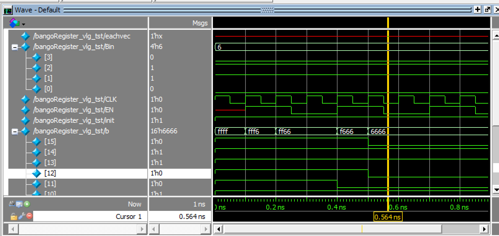
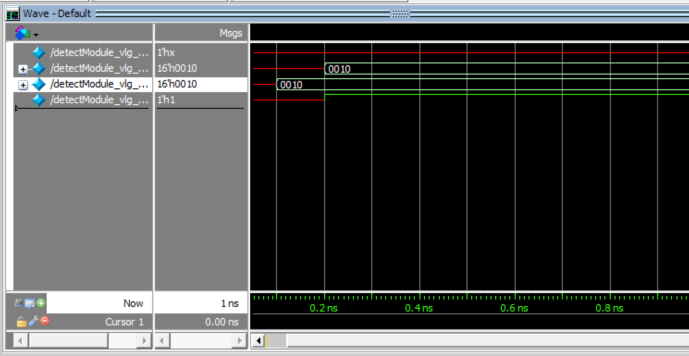
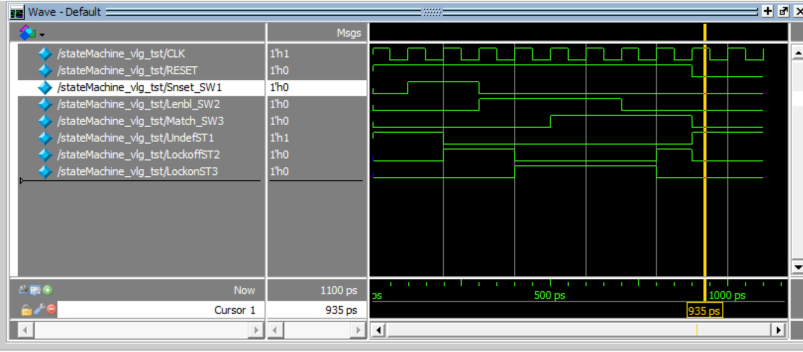

# 電子ロック作成実験

## 概要
* 以下のメインモジュール機能を作成してボトムアップで作成する。

## 課題機能
* 番号レジスタ
* 暗証番号レジスタ
* 番号一致検出レジスタ
* ステートマシン 

## シミュレーション
* シミュレーション結果：番号レジスタ

* シミュレーション結果：番号一致検出回路

* シミュレーション結果：ステートマシン

    * Tips:
    シミュレーション実行時に、シミュレーション時間を細かく区切って、force入力を組み合わせて入力する。（例えば、シミュレーション時間を200psとする。まずは、UNDEFの状態でSW1にforce入力として1を設定する。これでシミュレーションを実行すると状態遷移が起こり、LOCKOFF状態となる。つぎのシミュレーション実行で、SW1=0、SW2=1でそれぞれforce入力し、次の状態遷移を確かめる。以降、ステートマシンの状態遷移を同じように確認する。）
