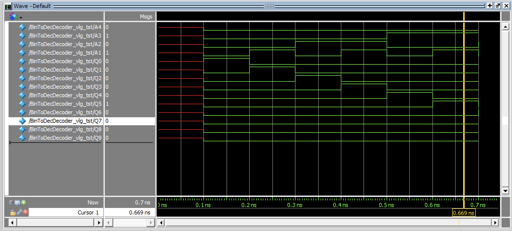

# NAND回路での論理式シミュレーション①

## QuartusPrimeでの論理回路図作成

## ModelSimでの波形シミュレーション
* 組み合わせ回路でのシミュレーション
    * シミュレーション結果
    
    * テストベンチ
    ```Verilog HDL
    // Copyright (C) 2020  Intel Corporation. All rights reserved.
    // Your use of Intel Corporation's design tools, logic functions 
    // and other software and tools, and any partner logic 
    // functions, and any output files from any of the foregoing 
    // (including device programming or simulation files), and any 
    // associated documentation or information are expressly subject 
    // to the terms and conditions of the Intel Program License 
    // Subscription Agreement, the Intel Quartus Prime License Agreement,
    // the Intel FPGA IP License Agreement, or other applicable license
    // agreement, including, without limitation, that your use is for
    // the sole purpose of programming logic devices manufactured by
    // Intel and sold by Intel or its authorized distributors.  Please
    // refer to the applicable agreement for further details, at
    // https://fpgasoftware.intel.com/eula.

    // *****************************************************************************
    // This file contains a Verilog test bench template that is freely editable to  
    // suit user's needs .Comments are provided in each section to help the user    
    // fill out necessary details.                                                  
    // *****************************************************************************
    // Generated on "12/08/2023 15:24:07"
                                                                                    
    // Verilog Test Bench template for design : BinToDecDecoder
    // 
    // Simulation tool : ModelSim-Altera (Verilog)
    // 

    `timescale 1 ps/ 1 ps
    module BinToDecDecoder_vlg_tst();
    // constants                                           
    // general purpose registers
    reg eachvec;
    // test vector input registers
    reg A1;
    reg A2;
    reg A3;
    reg A4;
    // wires                                               
    wire Q0;
    wire Q1;
    wire Q2;
    wire Q3;
    wire Q4;
    wire Q5;
    wire Q6;
    wire Q7;
    wire Q8;
    wire Q9;

    // assign statements (if any)                          
    BinToDecDecoder i1 (
    // port map - connection between master ports and signals/registers   
        .A1(A1),
        .A2(A2),
        .A3(A3),
        .A4(A4),
        .Q0(Q0),
        .Q1(Q1),
        .Q2(Q2),
        .Q3(Q3),
        .Q4(Q4),
        .Q5(Q5),
        .Q6(Q6),
        .Q7(Q7),
        .Q8(Q8),
        .Q9(Q9)
    );
    initial                                                
    begin                                                  
    // code that executes only once                        
    // insert code here --> begin                          

    #100 A1 <= 0;A2 <= 0;A3 <= 0;A4 <= 0;     
    #100 A1 <= 1;A2 <= 0;A3 <= 0;A4 <= 0;
    #100 A1 <= 0;A2 <= 1;A3 <= 0;A4 <= 0;
    #100 A1 <= 1;A2 <= 1;A3 <= 0;A4 <= 0;
    #100 A1 <= 0;A2 <= 0;A3 <= 1;A4 <= 0;
    #100 A1 <= 1;A2 <= 0;A3 <= 1;A4 <= 0;
    #100 A1 <= 0;A2 <= 1;A3 <= 1;A4 <= 0;
                                                        
    end                                                    

    endmodule
    ```
    * 5までシミュレーション
